# ***CONVERSION TOOL***

Conversion Tool is a Python terminal program, which runs in the Code Institute mock terminal on Heroku.

This program offers the opportunity to the user to make currency and unit conversions by using the Frankfurter API and the SymPy library. The Frankfurter API tracks the foreign exchange references rates published by the European Central Bank and the data refreshes around 16:00 CET every working day. The SymPy library offers unit conversions, based on the SI system and also many other scientific equations and calculations which are not part of this project.

[Click here to use the program](https://conversion-tool-parides55-be1a8d01898e.herokuapp.com/)

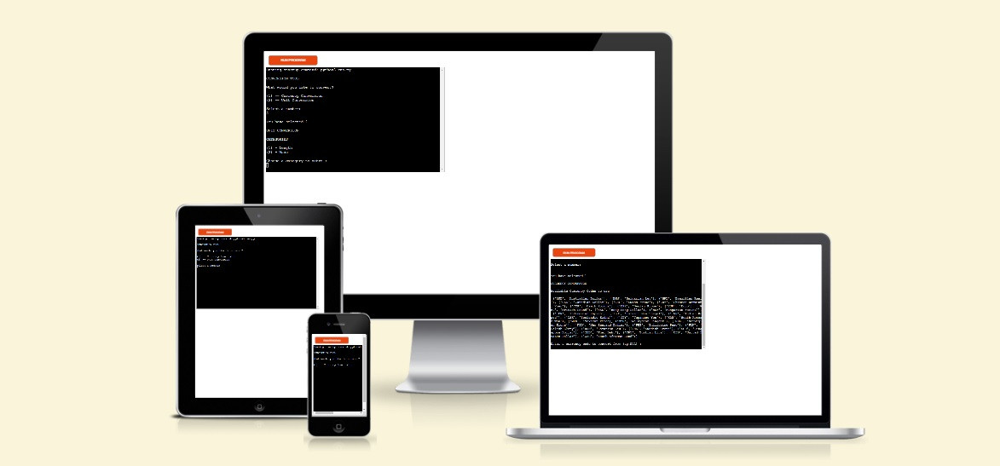

<b>Table of Content</b>(click to open)

- [***CONVERSION TOOL***](#conversion-tool)
  - [How to use it](#how-to-use-it)
  - [Features](#features)
      - [Existing Features](#existing-features)
      - [Future Features](#future-features)
  - [Data Model](#data-model)
  - [Testing](#testing)
  - [Bugs](#bugs)
  - [Validator Testing](#validator-testing)
  - [Deployment](#deployment)
  - [Credits](#credits)

## How to use it

When the program first runs, it provides the user with some selections, where the user can choose what to convert, Currency or Units.
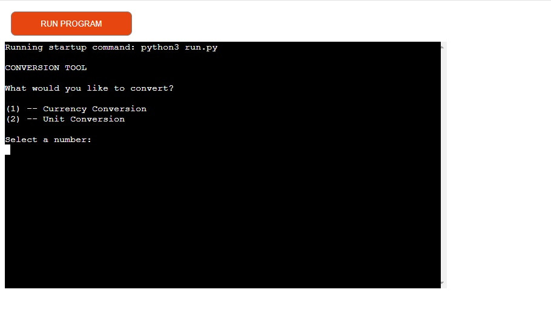

If Currency Conversion is selected, immediately a list of all available currency codes is shown to clearly indicate to the user what codes can be selected.
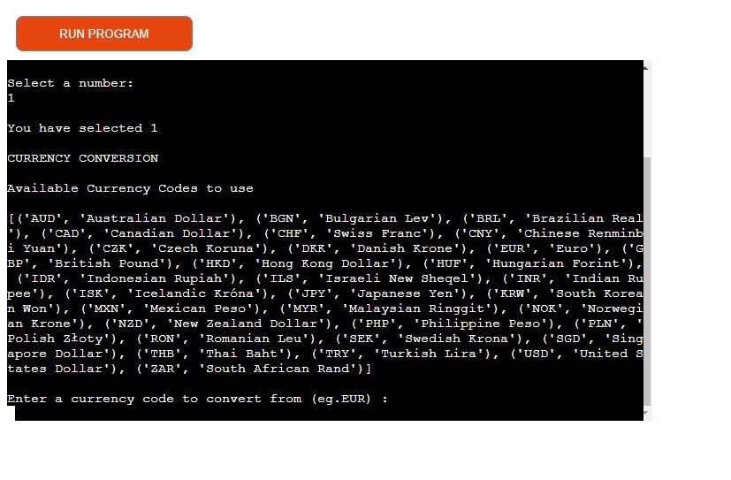

If Unit Conversion is selected the user is presented with more selections to make, regarding the category of the units the user wishes to convert. Currently only Mass and Length conversions are available.
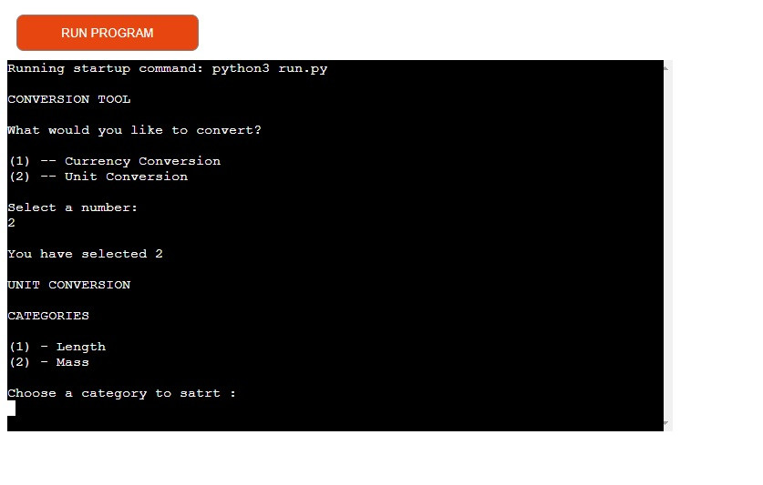

In both cases the user will be asked to input the currencies or the units that the user wishes to convert, and the program automatically will make the calculation using the Frankfurter API and the SymPy library.
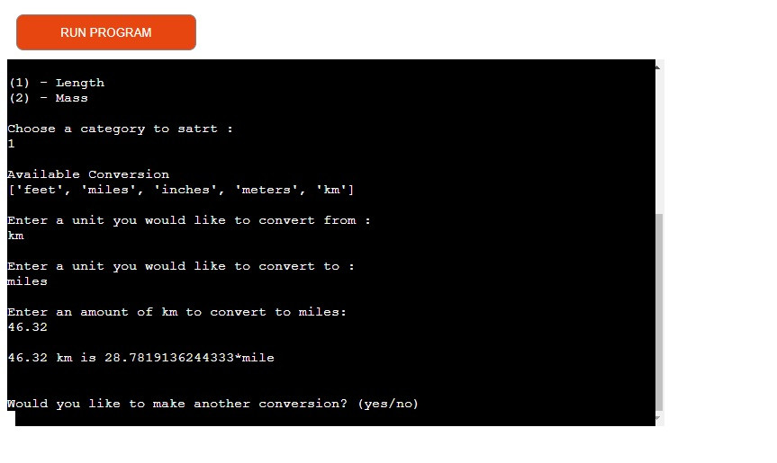

At the end of each conversion the user is asked if another conversion is needed or not. If yes, the user is taken to the initial selections between Currency and Unit conversions and if no, a Thank you message appears.
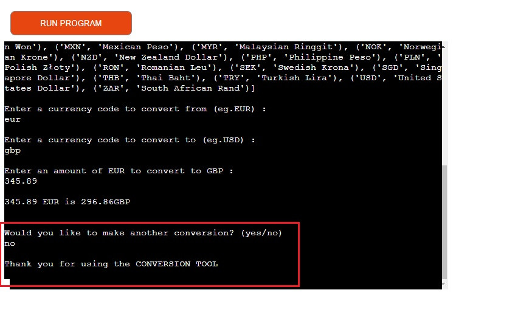

## Features

#### Existing Features

   - Currency Conversion
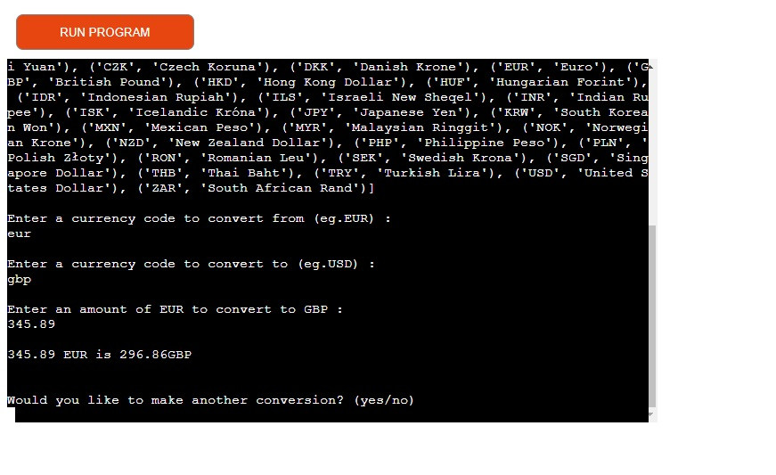

   - Unit Conversion
      - Mass conversion
      - Length conversion

   - Input validation and error-checking
      - Conversions with the same values cannot be made
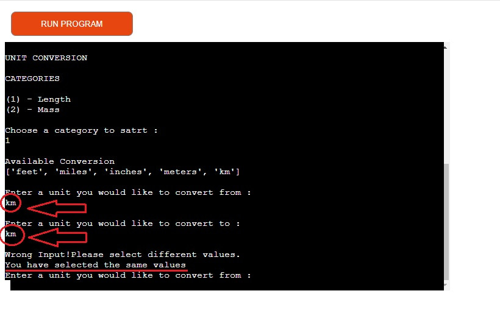
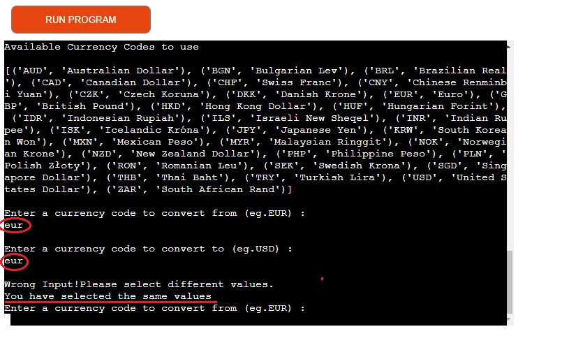
      - Where a number is required if a letter is insert will trigger an error message asking for the correct input
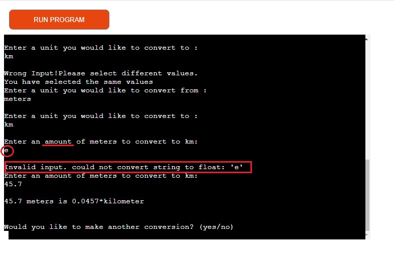
      - If a wrong selection is made or outside of the required range an error message appears asking for the correct input
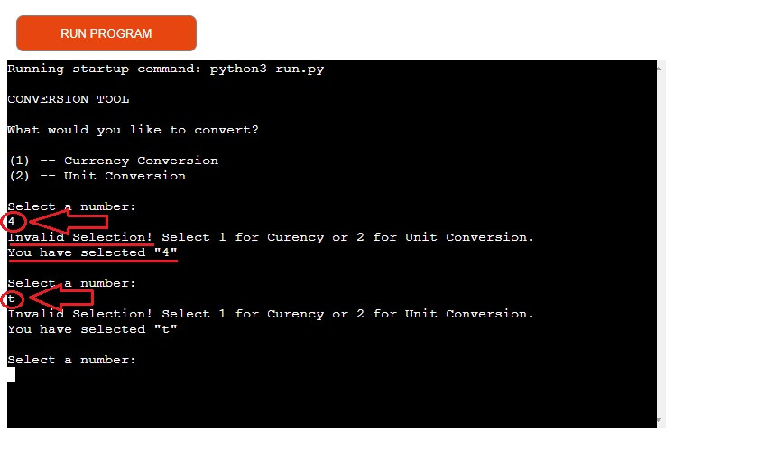

#### Future Features

- More unit conversions they may be included (e.g. Time, Temperature, Area conversions)
- More tools can be offered (e.g. calculator, calendar)

## Data Model

The Data model of this program uses mainly functions to run which are called in sequence to achieve the appropriate actions and a Class where the categories of the unit measurements are stored as class objects.

To design the flow of the this program I used flow charts from [Lucidcharts](https://www.lucidchart.com/pages/landing?utm_source=google&utm_medium=cpc&utm_campaign=_chart_en_tier1_mixed_search_brand_exact_&km_CPC_CampaignId=1490375427&km_CPC_AdGroupID=55688909257&km_CPC_Keyword=lucidchart&km_CPC_MatchType=e&km_CPC_ExtensionID=&km_CPC_Network=g&km_CPC_AdPosition=&km_CPC_Creative=442433236001&km_CPC_TargetID=kwd-33511936169&km_CPC_Country=1006528&km_CPC_Device=c&km_CPC_placement=&km_CPC_target=&gad_source=1&gclid=Cj0KCQiA-62tBhDSARIsAO7twbZK25INDZxdISoGwumDsnnDW3jnGbGMJ4cLderstF-_CwUACp2M7jIaAvLdEALw_wcB) as shown in the diagram below.

The user can choose what conversions to make through a series of options presented on the screen. For every selection and for every input the user is asked to make, there is always a validation check for that selection or that input, to avoid crashing the program through the built-in functions of Python (e.g. the float() will give a ValueError if a string is insert and the program will stop) and to keep the continuation and the smooth flow of the program to achieve the desire outcome and to maintain a safe and positive UX to the user.

## Testing

I have manually tested this project by doing the following:

  - Passed the code through a PEP8 linter and confirmer there are no problems
  - Extensively use the program making a lot of different combinations of inputs by inserting strings when numbers are expected, inserting the same value of units and selecting numbers out of bounds
  - Tested in my local terminal (VS Code) and the Code Institute Heroku terminal

## Bugs

Throughout my testing a few conversions would not work or return the expected value. That was because of typos in the code of the conversions, which were corrected and the code functions as it suppose to.

## Validator Testing

- PEP8
  - No errors were returned from [PEP8online.com](https://pep8ci.herokuapp.com/) 
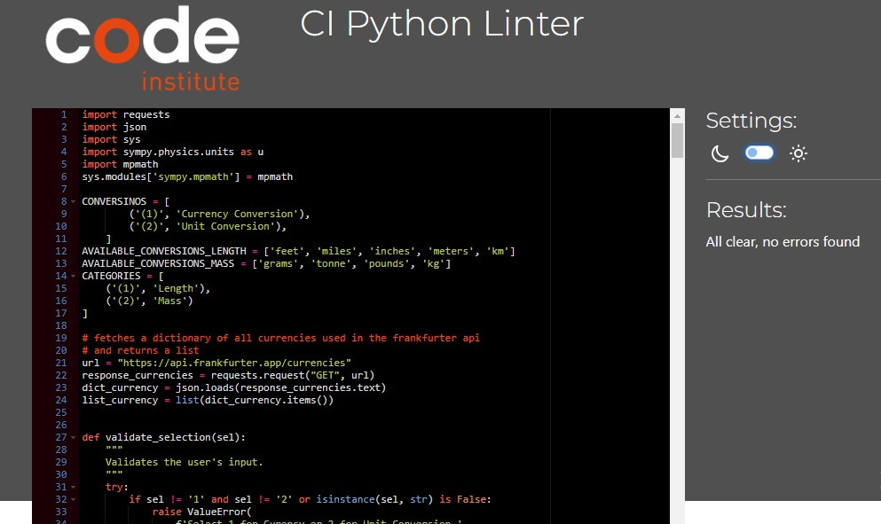

## Deployment

This project was deployed using Code Institute's mock terminal for Heroku.

  - Steps for deployment:
      - Fork or clone this repository
      - Create a new Heroku app
      - In the settings tap in the Heroku app insert in the Config Vars PORT as a key and 8000 as a value.
      - Set the buildbacks to Python and NodeJS in that order
      - Link the Heroku app to repository
      - Click on Deploy

## Credits

  - Code Institute for the deployment terminal
  - All validation checks for errors run with a <b><em>While</em></b> loop and use a try-except expression in their associated functions, which was taken from the [Love_Sandwiches project](https://learn.codeinstitute.net/courses/course-v1:CodeInstitute+LS101+2021_T1/courseware/293ee9d8ff3542d3b877137ed81b9a5b/c92755338ef548f28cc31a7c3d5bfb46/) of the Code Institute LMS.
  - [Frankfurter API](https://www.frankfurter.app/docs/) for the currency conversion
  - [SymPy library](https://www.sympy.org/en/index.html) for providing the code for the conversions